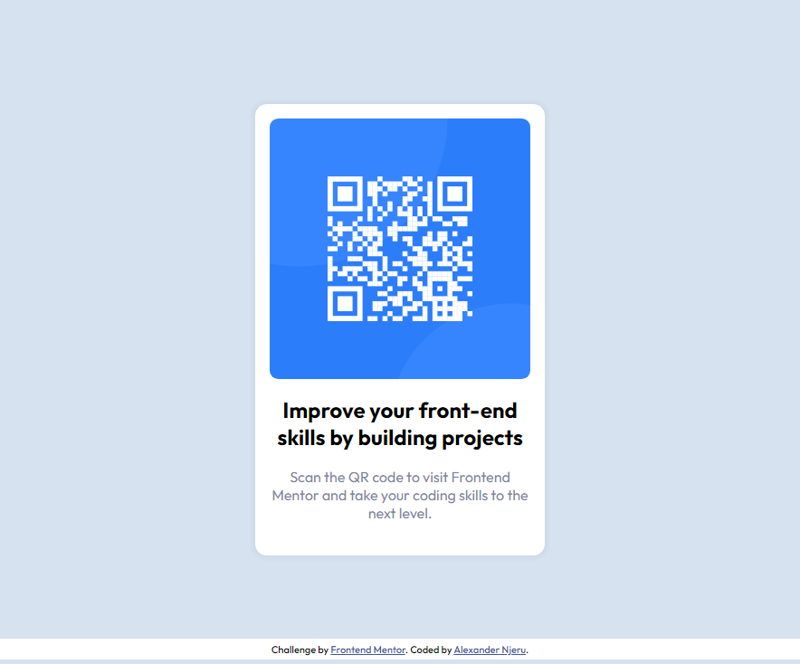

# Frontend Mentor - QR code component solution

This is a solution to the [QR code component challenge on Frontend Mentor](https://www.frontendmentor.io/challenges/qr-code-component-iux_sIO_H). Frontend Mentor challenges help you improve your coding skills by building realistic projects.

## Table of contents

- [Screenshot](#screenshot)
- [Links](#links)
- [My process](#my-process)
- [Built with](#built-with)
- [Author](#author)

### Screenshot

### Links

- Solution URL: [solution URL]([https://your-solution-url.com](https://t.co/9RIbvPEZ00))

- Live Site URL: [live site URL](https://your-live-site-url.com)

## My process

My task was to build out the project to the designs inside the `/design` folder. You will find both a mobile and a desktop version of the design.

The designs are in JPG static format. Using JPGs meant that i needed to use my best judgment for styles such as `font-size`, `padding` and `margin`.

You will find all the required assets in the `/images` folder.

There is also a `style-guide.md` file containing the information i used, such as color palette and fonts.

1. I first initialized my project as a public repository on [GitHub](https://github.com/). Creating a repo makes it easier to share my code.

2. I then configured my repository to publish my code to a web address. This will be useful if i need some help during a challenge as i can share the URL for my project with my repo URL.

3. I looked through the designs and started planning out how to tackle the project. This step was crucial to help me think ahead for CSS classes to create reusable styles.

4. Before adding any styles, i first structure my content with HTML, this helps me to focus my attention on creating well-structured content.

5. I added a styles.css file and wrote out the base styles for my project, including general content styles from the top of the page and worked down, only moved on to the next section once i was happy i had completed the area i was working on.

### Built with

- Semantic HTML5 markup
- CSS custom properties
- Flexbox
- CSS Grid
- Mobile-first workflow

## Author

- Website - [Alexander Njeru](https://www.your-site.com)

- Frontend Mentor - [@Kivuti-Njeru](https://www.frontendmentor.io/profile/Kivuti-Njeru)

- Twitter - [@therealkivuti](https://twitter.com/therealkivuti)
